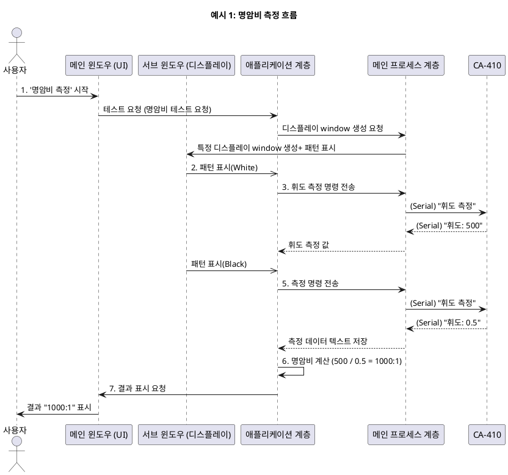
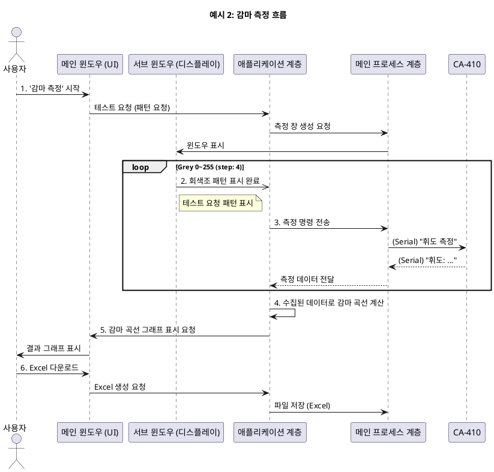

# DisplayTest 프로젝트

##  프로젝트 개요

이 애플리케이션은 디스플레이 패널의 품질을 정밀하게 측정하고 분석하기 위해 개발된 데스크톱용 테스트 솔루션입니다. 사용자는 다양한 테스트 패턴과 측정 항목을 통해 디스플레이의 성능을 종합적으로 평가할 수 있습니다.

##  주요 기능 상세

이 애플리케이션은 메인 윈도우와 서브 윈도우의 유기적인 연동을 통해 각종 디스플레이 테스트를 수행합니다. 메인 윈도우는 테스트 제어 및 결과 확인을, 서브 윈도우는 테스트 대상 디스플레이에 특정 패턴을 표시하는 역할을 합니다.

### 1. 패턴 생성 (Pattern Generation)
- **목적**: 다양한 표준 테스트 패턴(체커보드, 그라데이션, 단색 등)을 생성합니다.
- **동작**: 사용자가 메인 윈도우에서 패턴을 선택하면, 해당 패턴이 서브 윈도우를 통해 테스트 대상 디스플레이에 전체 화면으로 표시됩니다. 이는 다른 측정 기능들의 기반이 됩니다.

### 2. 명암비 (Contrast Ratio)
- **목적**: 디스플레이의 가장 밝은 색(White)과 가장 어두운 색(Black) 간의 비율을 측정하여 동적 범위를 평가합니다.
- **동작**: 흰색과 검은색 패턴을 순차적으로 테스트 대상 디스플레이에 표시하고, 각 상태에서 외부 측정 장비의 값을 읽어와 자동으로 명암비를 계산합니다.

### 3. 색 재현율 (Color Ratio)
- **목적**: 디스플레이가 특정 색 공간(sRGB, DCI-P3 등)의 색상을 얼마나 정확하게 표현하는지 측정합니다.
- **동작**: R, G, B 각각의 최대 색상 값을 테스트 대상 디스플레이에 표시하고, 외부 장비로 측정된 색 좌표를 통해 색 재현율을 계산하고 시각적으로 표시합니다.

### 4. 감마 (Gamma)
- **목적**: 디스플레이의 계조(Grayscale) 표현 능력이 표준 감마 곡선(예: 2.2)에 얼마나 근접하는지 측정합니다.
- **동작**: 여러 단계의 회색 패턴을 테스트 대상 디스플레이에 표시하고, 각 단계별 휘도를 측정하여 감마 곡선을 그래프로 보여줍니다.

### 5. 시야각 (Viewing Angle)
- **목적**: 디스플레이를 정면이 아닌 측면에서 보았을 때 색상이나 밝기가 얼마나 변하는지 평가합니다.
- **동작**: 특정 패턴을 표시한 상태에서, 사용자가 물리적으로 측정 장비의 위치를 변경하며 여러 각도에서 측정값을 기록하고 비교합니다.

### 6. 빛샘 (Light Leak)
- **목적**: 어두운 화면에서 디스플레이의 특정 영역이 의도치 않게 밝게 빛나는 현상을 검사합니다.
- **동작**: 검은색 패턴을 테스트 대상 디스플레이에 표시하고, 측정 장비로 화면의 여러 지점을 측정하여 휘도 균일성을 평가합니다.

### 7. 가독성 (Readability)
- **목적**: 텍스트, 아이콘 등의 가독성이 특정 환경(예: 차량 주행 환경)에서 얼마나 확보되는지 평가합니다.
- **동작**: 표준화된 텍스트/이미지 패턴을 테스트 대상 디스플레이에 표시하고, 측정 장비로 선명도(Sharpness)나 MTF(Modulation Transfer Function)를 측정하여 평가합니다.

### 8. Excel 다운로드
- **목적**: 측정된 모든 테스트 결과를 Excel 파일로 저장하여 보고서를 생성하거나 데이터를 관리합니다.
- **동작**: 사용자가 다운로드 버튼을 클릭하면, 현재까지 측정된 데이터를 기반으로 Excel 파일을 생성하여 로컬 시스템에 저장합니다.

## 기술 스택

- **Framework:** Electron
- **UI:** React, Tailwind CSS
- **Build:** Webpack
- **Backend:** Node.js, Express (for serial communication)

## 계층형 아키텍처 (Layered Architecture)

(이하 아키텍처 설명은 이전과 동일)

## 시스템 컨텍스트 및 비즈니스 로직

### 1. 시스템 컨텍스트 다이어그램 (System Context Diagram)

(이하 컨텍스트 다이어그램 설명은 이전과 동일)

### 2. 주요 기능 흐름 예시

#### 예시 1: 명암비 측정 흐름

**상세 설명:**

1.  **테스트 시작**: 사용자가 `메인 윈도우 (UI)`에서 '명암비 측정' 버튼을 클릭하여 **테스트 요청 (패턴 요청)**을 보냅니다.
2.  **측정 창 생성 및 패턴 표시**: `애플리케이션 계층`은 `메인 프로세스 계층`에 **측정 창 생성**을 요청하고, `서브 윈도우`는 요청된 패턴(예: 흰색)을 표시 후 완료 신호를 보냅니다.
3.  **측정 (White)**: 완료 신호를 받은 `애플리케이션 계층`은 `메인 프로세스 계층`과 `CA-410`을 통해 흰색 화면의 휘도 값을 측정합니다.
4.  **패턴 변경 및 측정 (Black)**: `서브 윈도우`가 검은색 패턴으로 변경되고, 3번 과정이 반복됩니다.
5.  **계산 및 결과 표시**: `애플리케이션 계층`은 측정된 두 값으로 명암비를 계산하여 `메인 윈도우`에 표시합니다.
6.  **Excel 다운로드**: 사용자가 `메인 윈도우`에서 다운로드 버튼을 클릭하면, `애플리케이션 계층`이 데이터를 취합하고 `메인 프로세스 계층`이 이를 Excel 파일로 생성하여 저장합니다.

---

#### 예시 2: 감마 측정 흐름

**상세 설명:**

1.  **테스트 시작**: 사용자가 `메인 윈도우 (UI)`에서 '감마 측정'을 시작합니다.
2.  **반복 측정**: `서브 윈도우`는 **Grey 0부터 255까지 4씩 증가**하며 회색조 패턴을 순차적으로 표시합니다. 각 패턴이 표시될 때마다 `애플리케이션 계층`은 `CA-410`으로 측정을 요청하고 휘도 데이터를 수신합니다.
3.  **계산 및 결과 표시**: 모든 단계의 측정이 완료되면, `애플리케이션 계층`은 수집된 데이터로 감마 곡선을 계산하여 `메인 윈도우`에 그래프로 표시합니다.
4.  **Excel 다운로드**: 사용자가 다운로드 버튼을 클릭하면, 모든 회색조 단계별 측정값이 담긴 Excel 보고서가 생성됩니다.
