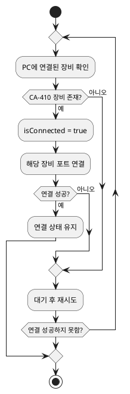

```plantuml
@startuml
start

repeat
    :PC에 연결된 장비 확인;

    if (CA-410 장비 존재?) then (예)
        :isConnected = true;
        :해당 장비 포트 연결;
        
        if (연결 성공?) then (예)
            :연결 상태 유지;
            break
        else (아니오)
        endif
    else (아니오)
    endif
    :대기 후 재시도;
repeat while (연결 성공하지 못함?)

stop
@enduml

```